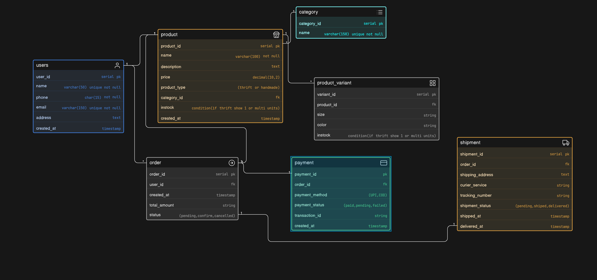

# Instagram Thrift & Hnadmade Creator Store - ER Diagram

## Project overviews

This project contains the Entity-Relationship diagram for Instagram-based thrift and handemade products store.

The business initially start with instagram DMs and whatsapp now it's grown up and need a structural database,
I try to crate a structure on behalf the bellow elements 

- Products (thrift & handmade)
- Instock availablity
- User details
- Orders
- Payments
- Shipments

## Key features

+ Supports both **thrift (unique item)** and **handmade (multiple quantity)** products
+ Manage **products variants** (size,color)
+ Maitain **stock_quantity**
+ Tracking **payment status** and **shipping status**

## ER Diagram

[View ER Diagram](https://janardan-mondal.github.io/thrift-ecommerce-SQL-architect-diagram/)
